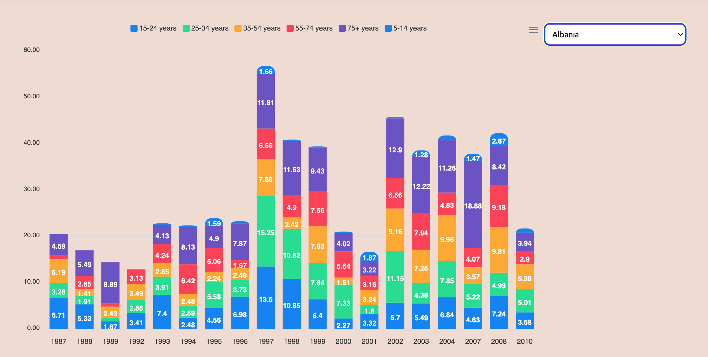
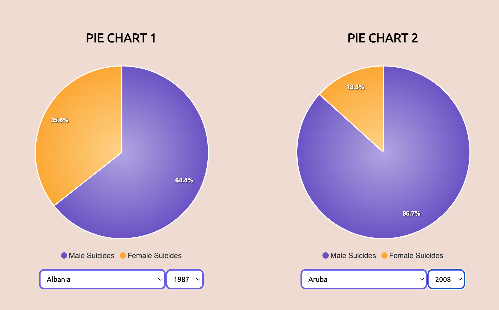
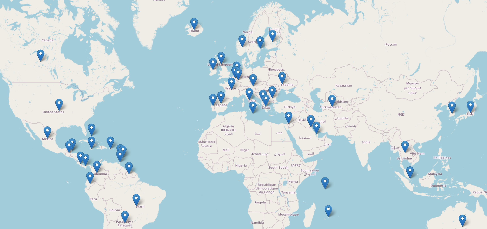
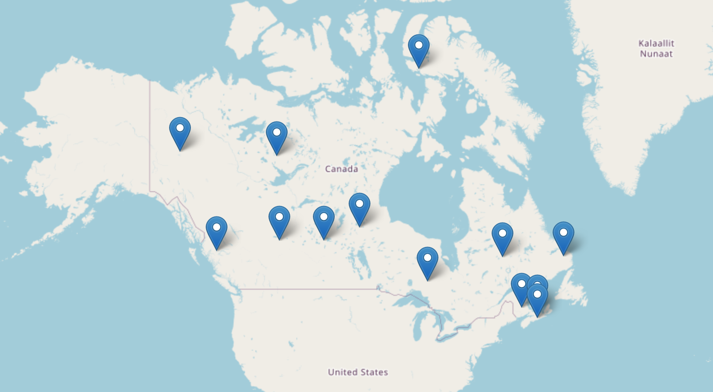

# Exploring the Spectrum of Suicide Rates: Project Three

## [DEPLOYED WEBPAGE](https://dayanaim.pythonanywhere.com/) (make sure to open it on the computer browser because it is not optimized for phones)
### [API END POINT 1](https://dayanaim.pythonanywhere.com/api/suicides_data)
### [API END POINT 2](https://dayanaim.pythonanywhere.com/api/pie_chart)
### [API END POINT 3](https://dayanaim.pythonanywhere.com/api/chart3data)
### [API END POINT 3](https://dayanaim.pythonanywhere.com/api/province_data)

## Collaborators: 
- [Dalya Lami](https://github.com/DalyaLami)
- [Ali Alam](https://github.com/AliAlam1998)
- [Jahn Ferdinandus](https://github.com/jahnferdinandus)
- [Dayana Imanova](https://github.com/DayanaIm)

## Table of Contents

- [About](#about)
- [Getting Started](#getting-started)
- [Installing](#installing)
- [Analysis](#analysis)
- [References](#references)

## About
Embark on a journey through the nuanced dimensions of suicide rates. Our comprehensive research spans geographical, age-related, yearly, 
GDP per capita, and population-based analyses, unraveling intricate patterns from 1985 to 2020. Explore the various factors that influence suicide rates, 
such as the impact of suicide prevention and support organizations, geographical variations, the interplay of age groups and generational factors, and make 
insightful comparisons with other leading causes of death.

### Research Goals

1) To investigate the intricate interplay between geographical variations in suicide rates and age-related patterns, aiming to understand the contributing factors and
provide comprehensive insights for the development of targeted suicide prevention strategies.

2) To conduct a comparative analysis of suicide rates across countries and years, specifically focusing on gender differences. The primary objective is to create two pie
charts that visually represent the distribution of female and male suicides, providing insights into gender-specific patterns and variations over time and between nations.

3) To investigate and analyze the correlation between GDP per capita and suicide rates across diverse countries, aiming to discern patterns and relationships that can contribute
to a nuanced understanding of the economic factors influencing suicide rates on a global scale.
   
4) To examine the relationship between the availability of health facilities and the incidence of suicide in Canada, with the objective of determining whether the number of health facilities has an impact on the total number of suicides.

## Getting started

### Prerequisites
Before you begin, ensure you have the following installed:
- Python 3.x
- Flask
- Required Python packages (Pandas)

## Installing

Install the necessary packages and download the repository files. Open the 'app.py' file and run it. This url [http://localhost:5000](http://localhost:5000) should open the website.

## Analysis

### Unraveling Suicide Disparities: A Geographical Analysis and Patterns Across Age Groups

### Analyzing Gender Disparities: A Comparative Study of Suicides

### GDP per Capita and Suicide Rates: A Global Examination

### Decoding Suicide Statistics: Health Facilities' Impact in Canada

  
## References
 - Dataset for [suicide statistics for canadian provinces](https://www.suicideinfo.ca/local_resource/suicide-stats-canada-provinces/)
 - Dataset for [suicide_rates_1985 2021](https://www.kaggle.com/datasets/omkargowda/suicide-rates-overview-1985-to-2021)
 - [Icons](https://www.flaticon.com/)
 - [Leaflet](https://leafletjs.com/)
 - [ApexCharts](https://apexcharts.com/)

